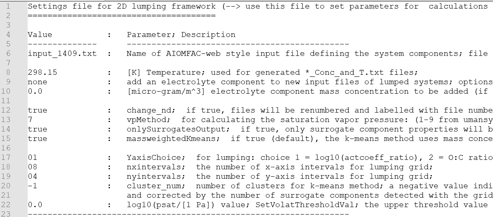

# 2D_Polarity_Volatility_lumping
This repository provides code-level access to a 2D framework for lumping of gas and/or aerosol components into an adjustable set of surrogate components to represent a complex system of hundreds to tens of thousands of components. The 2D space and related lumping approaches are based on the predicted polarity and volatility of the system's molecules.
This 2D framework is described in detail in a related scientific modeling article by Amaladhasan et al. (*in prep.*).
The framework includes the Aerosol Inorganic–Organic Mixtures Functional groups Activity Coefficients ([AIOMFAC](https://aiomfac.lab.mcgill.ca "AIOMFAC")) model (core code) to enable the computation of activity coefficient ratios as one option for expressing the polarity of organic molecules. The surrogate selection methods include grid-based sampling of the 2D polarity–volatility space or the use of a *k*-means-based mass-weighted medoid clustering method. The latter is the recommended method when computationl cost is not a relevant factor; see the discussion in Amaladhasan et al. (*in prep.*).  

----
## Dependencies
- `SMILES_to_AIOMFAC_inp` program: As part of the outputs from the framework, input files for the AIOMFAC(-web) model are generated for each surrogate system. This is done, in part, by calling the [SMILES_to_AIOMFAC (S2AS) tool](https://github.com/andizuend/S2AS__SMILES_to_AIOMFAC). For this to work, your local 2D-lumping framework main folder needs to be located and accessible under the same parent directory as the 'SMILES_to_AIOMFAC_inp' tool folder.
  
- The `CustomizedPlots_Dislin` folder contains an additional Fortran program for the generation of plots using 2D framework output located in the folder `Output_lumping`. Such plots may require specific settings near the top of the `CustomizedPlotting` program .f90 file; e.g., for `lumpResChar`, `maxrows`, and the file range to be considered. Output from `CustomizedPlots_Dislin` will be located in its own `Output_Plots` subfolder.
  
- (optional) A [MS Visual Studio Community](https://visualstudio.microsoft.com/vs/community/) installation equipped with [Intel's oneAPI for Fortran](https://www.intel.com/content/www/us/en/docs/oneapi/installation-guide-windows/2025-0/intel-fortran-essentials.html). OneAPI provides the Intel `ifx` Fortran compiler (available for Windows or Linux).
  
- (optional) **Dislin** plotting library: The included plotting program expects that Dislin is installed at its default location of `c:\dislin` (on a Windows machine). [Dislin download and installation information](https://www.dislin.de/index.html "Dislin") is provided on its official website. For examples see also the [Dislin_x_y_plots repository](https://github.com/andizuend/Dislin_x_y_plot). If plotting with Dislin is not desired, the whole `CustomizedPlots_Dislin` folder can be removed from your local copy of this repository (it is distinct and has no impact on the 2D lumping computations).

----
# Quick guide to running the 2D lumping framework
The 2D lumping framework can be run simply via an executable (see example below), but a more powerful and convenient option is to run it via an IDE like MS Visual Studio Community with Intel's oneAPI ifx Fortran compiler (see [Dependencies](#dependencies)). For this purpose the Visual Studio solution (`.sln`) and related project files are included in this repository under `./2D_lumping_code/2D_Pol_Vol_lumping_with_AIOMFAC.sln`. 

The 2D lumping framework requires three distinct types of input files to characterize the components of a chemical system, generated with external tools: (1) An AIOMFAC-web-style input file listing the system components, (2) a file listing concentrations of all components, and (3) a pure-component vapour pressure file. The details for the generation of such files and specific format requirements are described below. Specific parameters for the choice of polarity axis and resolution of the lumping step are stated by the user in an editable `SETTINGS_2DLumping.txt` file. The three input files characterizing a specific chemical system and the settings file need to be present/copied into folder `Input_lumping`.

#### Necessary input files:
1. **AIOMFAC input file**: An AIOMFAC-web-style input file named `input_????.txt` is needed, where ???? represents a 4-digit case number of your choosing. This file needs to be copied into folder `Input_lumping`. For example, the file `input_1409.txt`, included in this repository's `Input_lumping` folder, shows the correct format and structure. Such files can be generated automatically by using the [SMILES_to_AIOMFAC (S2AS) tool](https://github.com/andizuend/S2AS__SMILES_to_AIOMFAC) with a list of SMILES for the organic molecules. Follow the detailed instructions in that related [S2AS repository](https://github.com/andizuend/S2AS__SMILES_to_AIOMFAC/edit/main/README.md). 

2. **Concentrations file**: A file listing the water vapour and organic (gas phase) concentrations is needed. It should be named `input_concentrations_????.txt` (with the same 4 digit number as for step 1.). An example file, `input_concentrations_1409.txt`, is included in folder `Input_lumping`. The concentration inputs per component would typically be obtained from the output of a case-specific chemical reaction simulation (see examples in Amaladhasan et al., *in prep.*). Note that when using the [SMILES_to_AIOMFAC (S2AS) tool](https://github.com/andizuend/S2AS__SMILES_to_AIOMFAC) to generate the AIOMFAC input file, the same input concentrations file is also needed to ensure consistency and alignment with the processed SMILES and related AIOMFAC input file.  

3. **Pure-component saturation vapour pressure file**: For each organic component listed under steps 1. \& 2., parameters need two be provided to enable the calculation of the pure-component liquid-state saturation vapour pressure as a function of temperature. The 2D lumping framework is setup to accept a specific format of such files, which can be generated by an adapted version of the [UManSysProp](https://github.com/loftytopping/UManSysProp_public) property prediction facility. The specific UManSysProp version and additional Python scripts that allows for the generation of compatible vapour pressure input files are available as a zipped folder from [this Zenodo archive](https://doi.org/10.5281/zenodo.17172675). Using this archived version, the following steps should be completed to generate the vapour pressure file needed for the 2D lumping framework:
    - Unzip the archived `SMILES_to_sat_vapour_pressure` file to a local folder. The Python dependencies (Open Babel, pybel) for using the included code are the same as for the [SMILES_to_AIOMFAC (S2AS) tool](https://github.com/andizuend/S2AS__SMILES_to_AIOMFAC). 
    - It is recommended to first run the S2AS tool to generate the AIOMFAC input file (step 1. above; follow instructions for the S2AS tool), after which you can copy the relevant `smiles_????.txt` from the `S2AS__SMILES_to_AIOMFAC/InputFiles` folder to the folder `SMILES_to_sat_vapour_pressure/InputFiles`. This recommendation is due to potential modifications of the smiles and concentration files by the S2AS tool. If steps 1. and 2. were already carried out with the S2AS tool, then consistency is already guaranteed.
    - (on Windows) Open the `SMILES_to_sat_vapour_pressure/Run_sat_vapor_pressure_pred.bat` .bat file with a text editor and set the 4-digit number part of your case number (e.g. 1409), then save and close the .bat file. Now this batch file can be run (double click); it will run the `SVP_Creator.py` script, which accesses several of the UManSysProp pure-component liquid-state vapour pressure prediction methods), followed by the `SVP_Fitter.py` script.
    - (alternatively, using a command prompt) Similarly to the .bat file step, those Python scripts could also be run in a command terminal, with the relevant `????` 4-digit case number provided as first command-line argument of SVP_Creator.py, e.g. `python .\SVP_Creator.py 1409`, which generates vapour pressure data at several temperatures; after, run `python .\SVP_Fitter.py 1409` to generate an output file listing two fitted parameters per vapour pressure method.
    - The output from the `SMILES_to_sat_vapour_pressure` tool will be a file named `vaporpressure_????.txt` (e.g. vaporpressure_1409.txt) in subfolder `OutputFiles` of the SMILES_to_sat_vapour_pressure directory. An example of the file structure is shown for `vaporpressure_1409.txt` in this repository in the `Input_lumping` folder. Such `vaporpressure_????.txt` files also list the SMILES of the components included.

## Running a customized case
To run a specific case (number) once the necessary input files have been prepared, go to folder `Input_lumping` and use a text editor (e.g. notepad or within Visual Studio) to modify the lumping framework settings file named `SETTINGS_2DLumping.txt`. This file allows you to set the conditions for a particular lumping calculation; see image below. 

  

There are ~13 settings (the value column in the file) that should be checked and modified if needed. In particular, on line 6 of the settings file, make sure that the correct AIOMFAC-web-style input file is stated (e.g. input_1409.txt). On lines 17--19, set the choice of polarity axis (1 is the default) and the number of x-axis and y-axis intervals (i.e. the resolution of the lumping grid). Line 22 allows one to set a high-volatility threshold in terms of the value of $\log_{10}(p^{sat}/[1 \mathrm{Pa}])$. As stated in the parameter description text of the settings file, this threshold is used to lump all components of volatilities higher than this into a special surrogate (see also description in *Amaladhasan et al.*).

#### Option 1: (using MS Visual Studio on Windows)
- TBA 
#### Option 2: (using an executable)
- Open ...
